# 🗄️ AWS & SQL Database Engineering Projects

This repository demonstrates both:

- 📐 Relational database design (3NF, PK/FK, ISA, M:N)
- ☁️ Cloud-based database application engineering (AWS EC2 + Apache + Python)

It bridges database theory and production-style deployment.

---

# 📁 Project: TradingDB – Relational Database & AWS Application

## 🔍 Overview

A simulated financial trading database managing:

- Clients
- Financial Officers
- Contracts
- Contact Information
- Company / Individual Client Types

Deployed as a live web-based SQL application on AWS EC2.

---

# 🧱 System Architecture

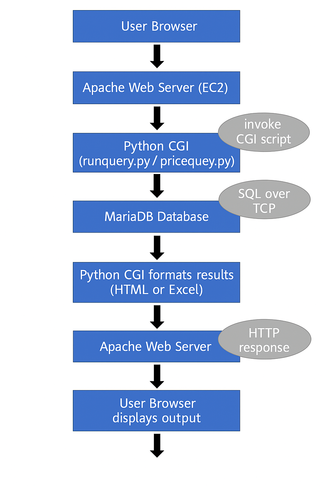

Architecture:

- AWS EC2
- Apache Web Server (CGI)
- MariaDB
- Python backend
- Pandas Excel export
- Browser-based SQL interface

---

# 🔐 AWS Deployment

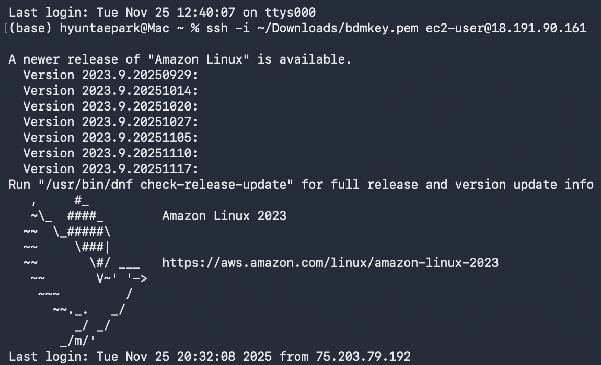

---

# 📜 Apache Logs

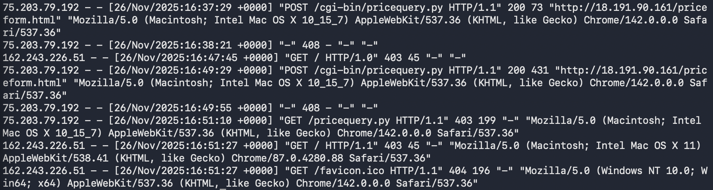

---

# 🌐 Web SQL Interface

---

# 📊 Query Example

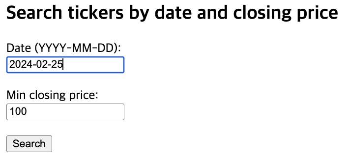

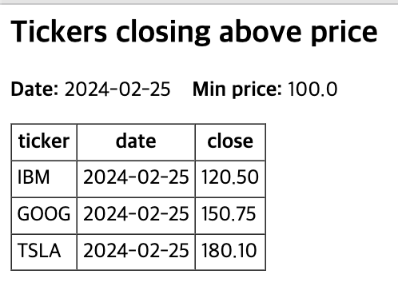

---

# 📥 Excel Export Pipeline

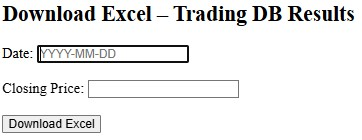

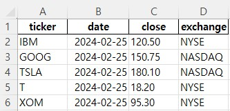

---

# 🐍 Python Backend

## Database Connection
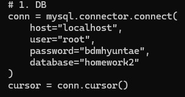

## SQL Execution
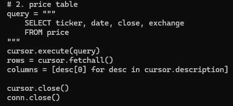

## Pandas Export
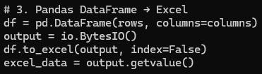

---

# 🗂️ Relational Model Evidence

## Financial Officer Table
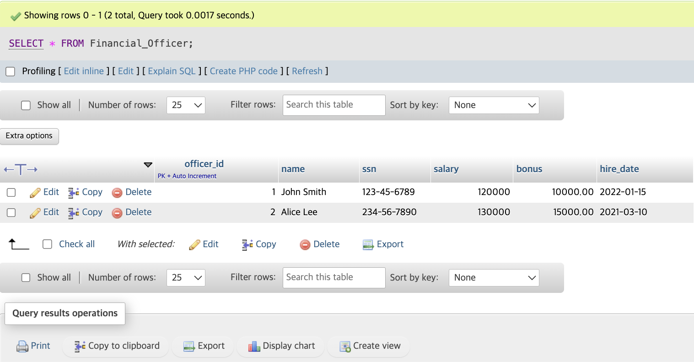

## Client Master Table
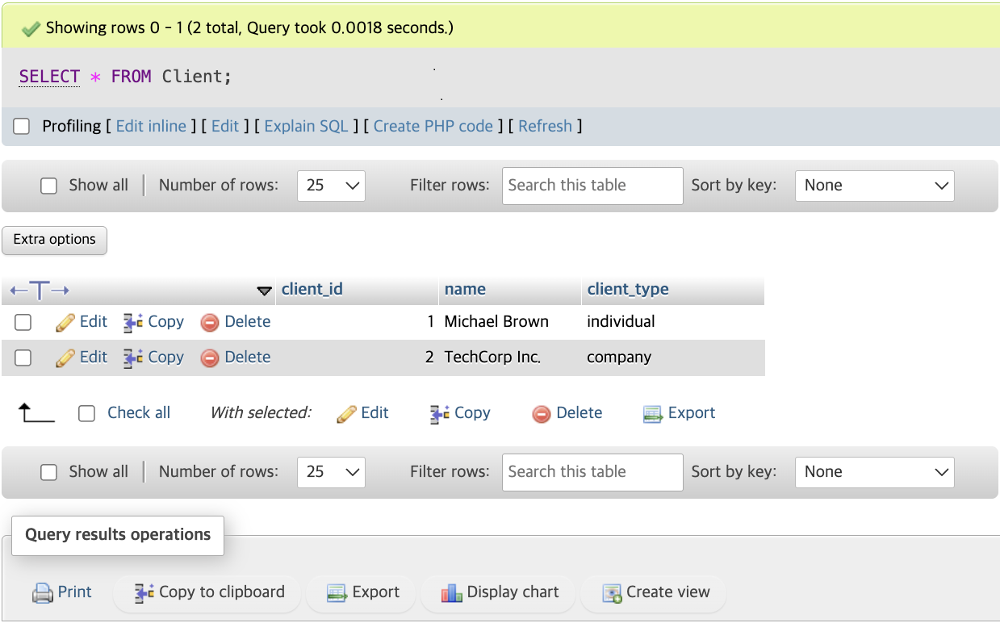

## Individual Client (ISA)
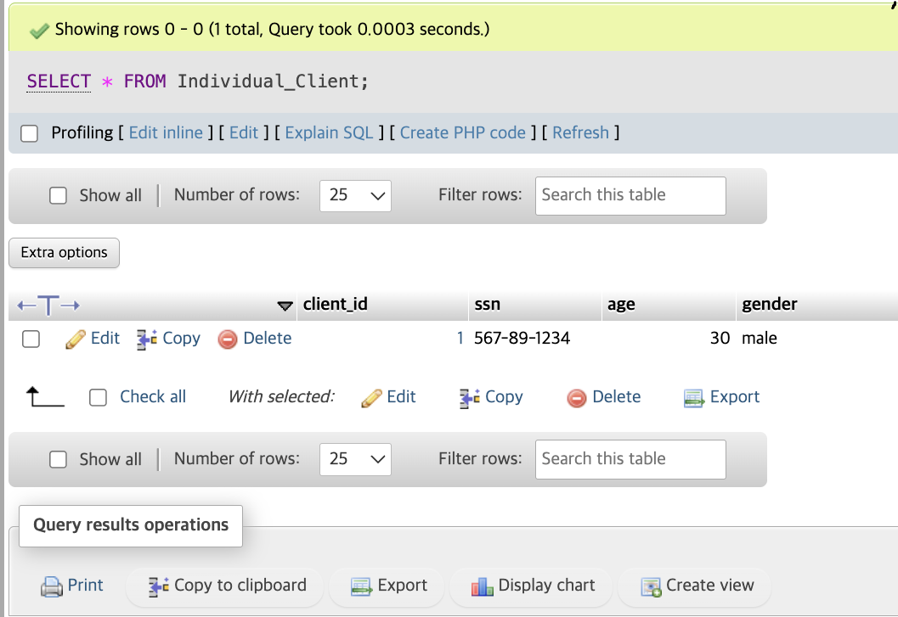

## Company Client (ISA)
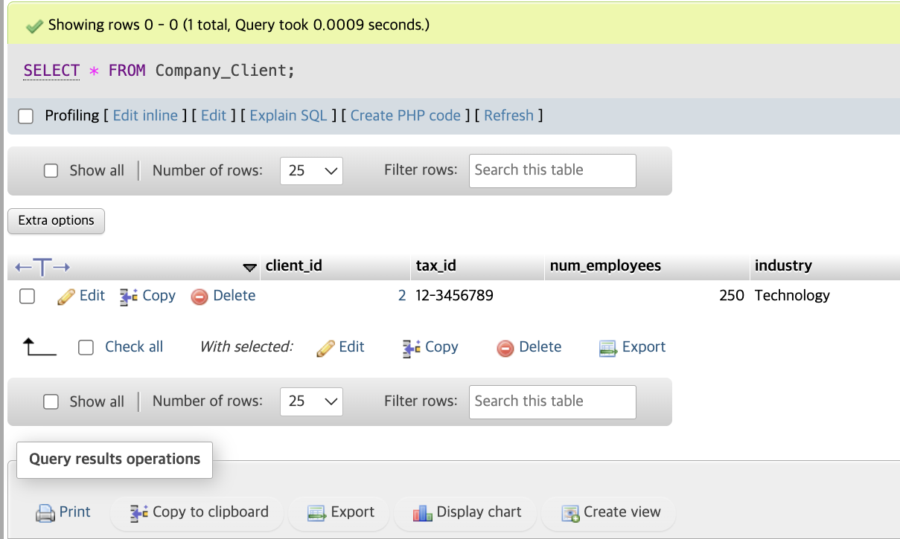

## Contact Info (1:N)
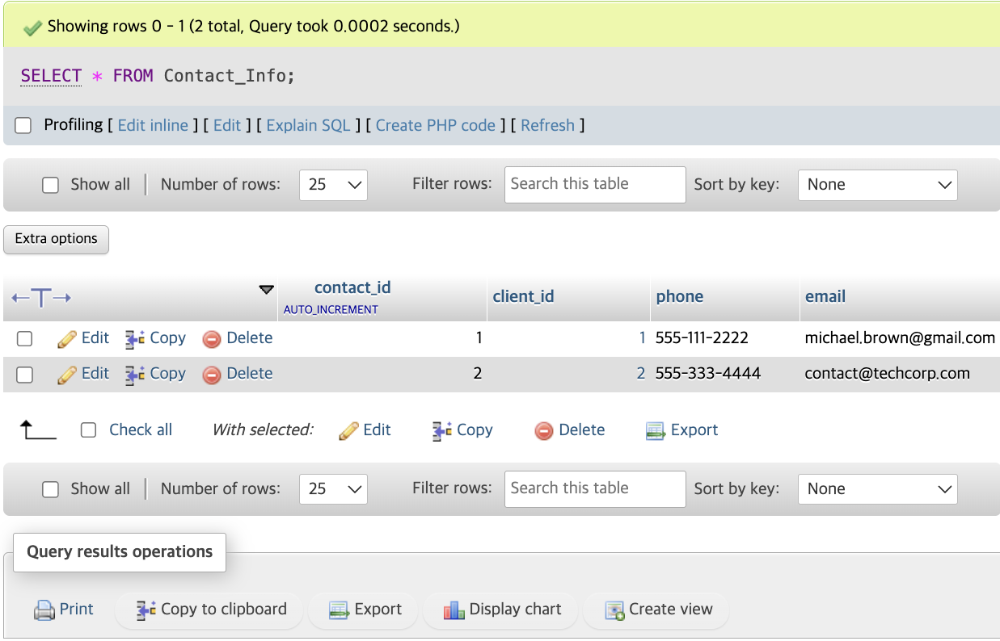

## Contract Master
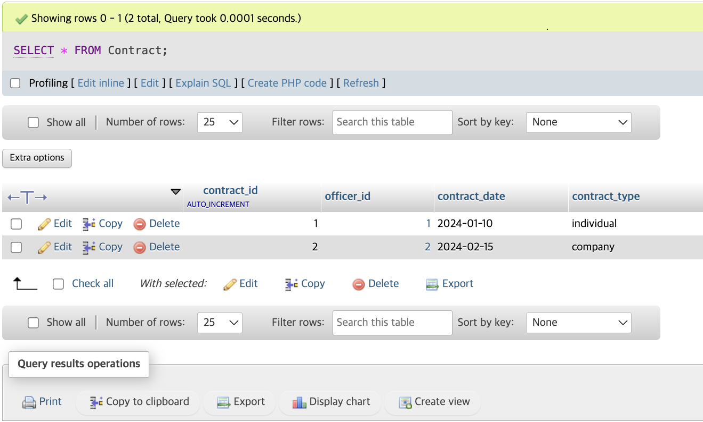

## Contract ↔ Client (M:N via Junction)
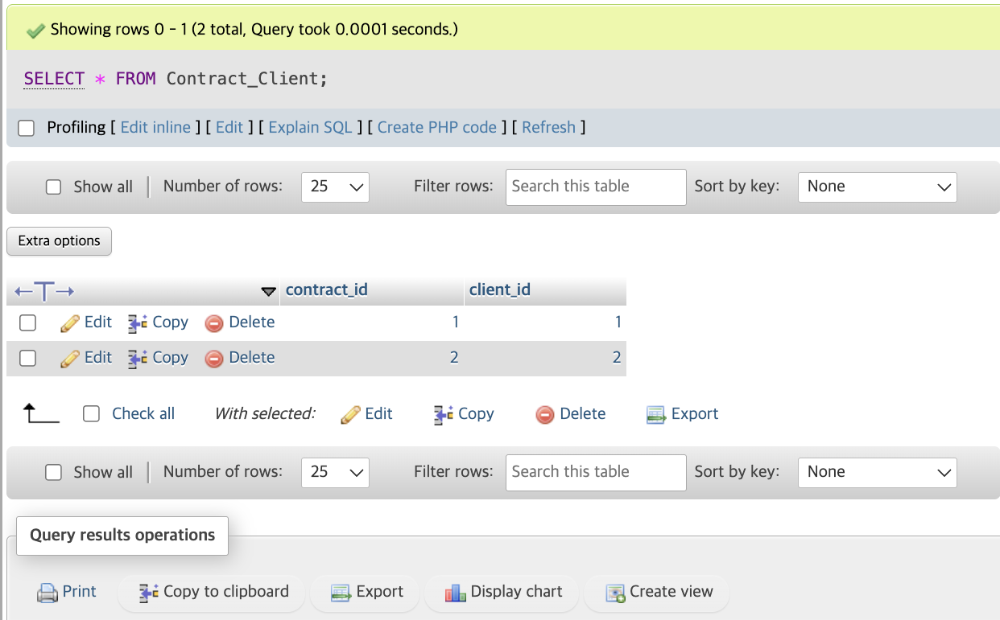

---

# 🧠 Database Design Features

- 3rd Normal Form (3NF)
- Primary / Foreign Keys
- ISA Specialization (Individual vs Company)
- One-to-Many Relationships
- Many-to-Many Relationships via Junction Tables
- Referential Integrity Enforcement

---

# 🛠️ Technology Stack

- AWS EC2
- Apache (CGI)
- MariaDB
- SQL (DDL, DML)
- Python
- Pandas
- ER Modeling

---

# 🎯 Engineering Value

This project demonstrates:

- Database schema design
- Referential modeling
- Cloud deployment
- Backend integration
- Data export automation
- Production-style architecture thinking

---

# 📂 Project Structure

stock-trading-database/
├─ README.md
├─ ERD/
│  └─ ER_Diagram.pdf
├─ schema/
│  └─ create_tables.sql
├─ queries/
│  ├─ basic_queries.sql
│  ├─ joins.sql
│  └─ advanced_queries.sql
├─ backend/
│  ├─ db_connection.py
│  ├─ query_handler.py
│  └─ export_excel.py
└─ docs/
   └─ database_overview.md

---
